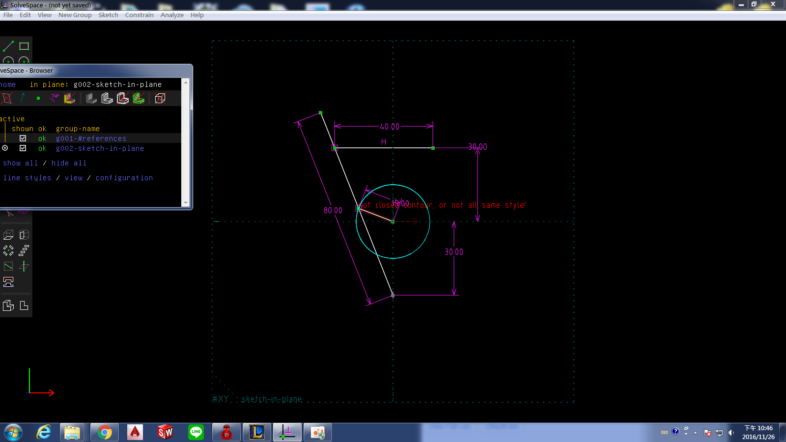
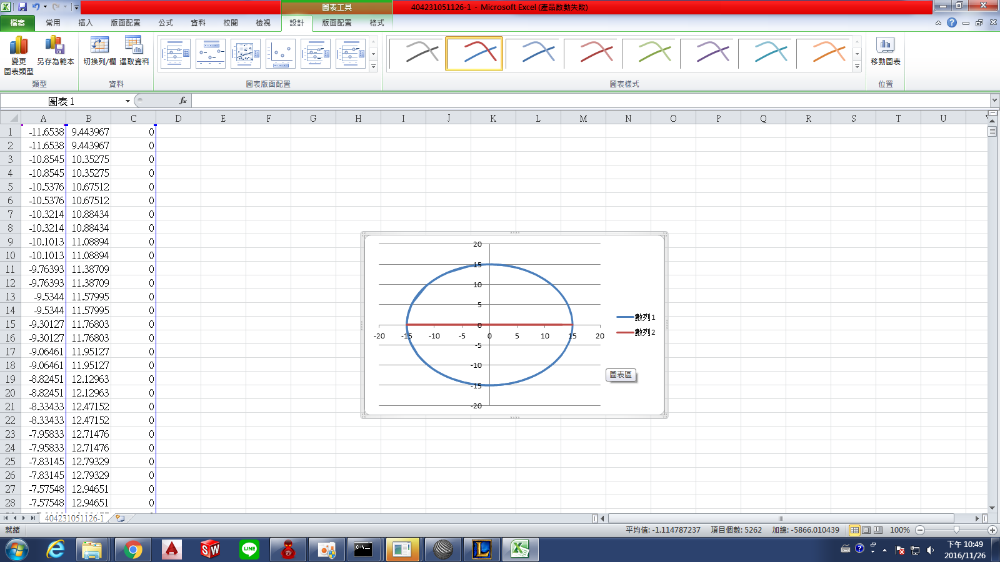
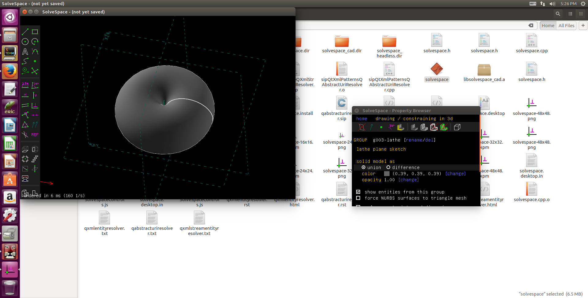

Title: 40423128 11/24作業
Date: 2016-11-24 11:00
Category: HW
Tags: 作業
Author: 40423128

40423128 11/24作業

<!-- PELICAN_END_SUMMARY -->

## Solvespace

### 1. Parts (零件繪製)

範例檔案: <a href="http://solvespace.com/bracket.pl">http://solvespace.com/bracket.pl</a>

#### Extrude (平行長出或除料)

STL 格式

範例:平行長出

<iframe src="./../data/threejs/4042310511241.html" width="800" height="600"></iframe>

STL 格式

範例:除料

<iframe src="./../data/threejs/4042310511243.html" width="800" height="600"></iframe>

#### Lathe (旋轉繞行長出或除料)

#### Export Triangle Mesh

STL 格式

three.js

<iframe src="./../data/threejs/20161201.html" width="800" height="600"></iframe>

### 2. Assembly (零件組立)

<iframe src="./../data/threejs/404231051125.html" width="800" height="600"></iframe>
<iframe src="https://player.vimeo.com/video/198525107" width="640" height="360" frameborder="0" webkitallowfullscreen mozallowfullscreen allowfullscreen></iframe>

<a href="https://vimeo.com/198525107">644401039</a> from <a href="https://vimeo.com/user45924793">Su  Sam</a> on <a href="https://vimeo.com">Vimeo</a>.

### 3. Linkages (fourbar & multilink) (四連桿與多連桿運動模擬)

### 4. Compiled & API (編譯與延伸應用)

使用 Virtualbox 虛擬主機執行 Windows 64 位元與 Ubuntu 64 位元環境中的編譯與延伸應用.

